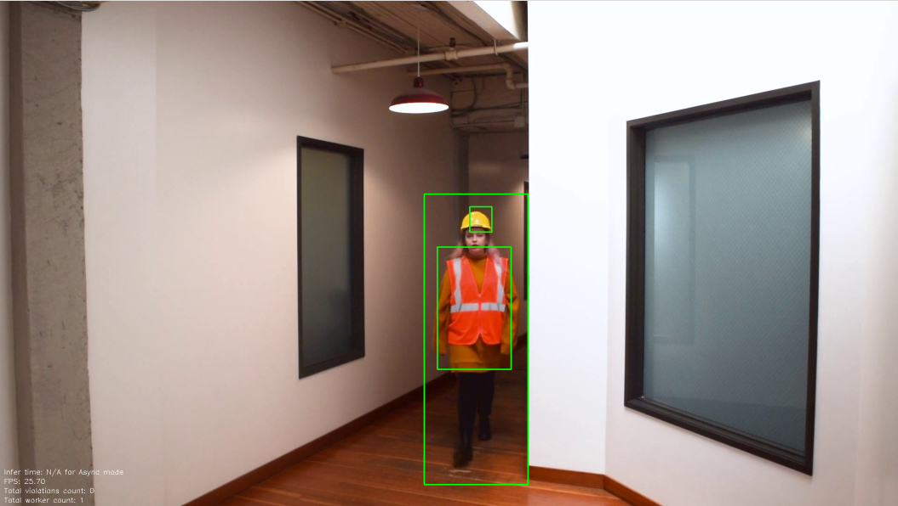
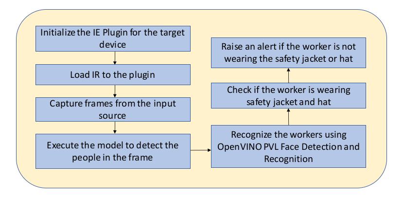

# Safety Gear Detector

| Details               |                    |
| --------------------- | ------------------ |
| Target OS:            | Ubuntu\* 16.04 LTS |
| Programming Language: | C++                |
| Time to Complete:     | 45 min             |



**Figure 1:** An application capable of detecting and identifying people in a video and detecting if people are wearing safety-jackets and hard-hats. 

## What It Does

This application is one of a series of IoT reference implementations illustrating how to develop a working solution for a particular problem. It demonstrates how to create a smart video IoT solution using Intel® hardware and software tools. This reference implementation monitors human figures passing in front of a camera, runs facial detection and recognition in order to identify the workers, and detects if they are violating safety gear standards.

## How It Works

The application uses the Inference Engine included in the Intel® Distribution of OpenVINO™ toolkit.    

Firstly, a trained neural network detects people in the frame and displays a green colored bounding box over them. For each person detected, the application runs a classical Machine Learning algorithm for facial detection and recognition to identify the worker in the video. Finally, for each worker identified, the application determines if they are wearing a safety-jacket and hard-hat. If they are not, an alert is registered with the system. The application detects the safety gear only on the people registered as workers in the database.



**Figure 2:** Architectural Diagram

## Requirements

### Hardware

- 6th Generation Intel® Core™ processor with Iris® Pro graphics or Intel® HD Graphics

### Software

- [Ubuntu\* 16.04 LTS](http://releases.ubuntu.com/16.04/) <br>
  *Note*: We recommend using a 4.14+ Linux* kernel with this software. Run the following command to determine the kernel version:

  ```
  uname -a
  ```

- OpenCL™ Runtime Package

- Intel® Distribution of OpenVINO™ toolkit R5 Release

## Setup

### Install Intel® Distribution of OpenVINO™ toolkit

Refer to [Install Intel® Distribution of OpenVINO™ toolkit for Linux*](https://software.intel.com/en-us/articles/OpenVINO-Install-Linux) to learn how to install and configure the toolkit.

Install the OpenCL™ Runtime Package to run inference on the GPU, as shown in the instructions below. It is not mandatory for CPU inference.

### Install FFmpeg*

FFmpeg* is installed separately from the Ubuntu repositories:

```
sudo apt update
sudo apt install ffmpeg
```

## Configure the Application

### Which Model to Use

The application uses the **person-detection-retail-0013** Intel® model found in the `deployment_tools/intel_models` folder of the Intel® Distribution of OpenVINO™ toolkit installation.

### The Config File

The _resources/conf.txt_ contains the videos that will be used by the application as input. Each line, formatted as `path/to/video`, represents one video and its path location on a local system. 

For example:

```
videos/video1.mp4
```

The application can use any number of videos for detection (i.e., the _conf.txt_ file can have any number of lines), but the more videos the application uses in parallel, the more the frame rate of each video scales down. This can be solved by adding more computation power to the machine on which the application is running.

### Use an Input Video File

The application works with any input video. Find sample videos for object detection [here](https://github.com/intel-iot-devkit/sample-videos/).  

For first-use, we recommend using the *Safety_Full_Hat_and_Vest.mp4* video present in the `resources/` directory.   

For example `conf.txt`:

```
../resources/Safety_Full_Hat_and_Vest.mp4
../resources/Safety_Full_Hat_and_Vest.mp4
```

### Use a Camera Stream

Replace `path/to/video` with the camera ID in the _resources/conf.txt_, where the ID is taken from the video device (the number X in /dev/videoX).

On Ubuntu, to list all available video devices use the following command:

```
ls /dev/video*
```

For example, if the output of above command is **/dev/video0**, then `conf.txt` would be:

```
0
```

## Set Up the Environment

Configure the environment to use the Intel® Distribution of OpenVINO™ toolkit by exporting environment variables:

```
source /opt/intel/computer_vision_sdk/bin/setupvars.sh
```

**Note:** This command needs to be executed only once in the terminal where the application will be executed. If the terminal is closed, the command needs to be executed again.  

## Build the Application

To build, go to _safety-gear-detector-cpp_ and run the following commands:

```
mkdir -p build && cd build
cmake ..
make
```

## Run the Application

Change directory to build:

```
cd build/
```

A user can specify the target device with the device command-line argument `-d` followed by a value: `CPU`, `GPU` or `MYRIAD`.

### Run on the CPU

Although the application runs on the CPU by default, this can also be explicitly specified through the `-d CPU` command-line argument:

```
./safety-gear-detector -d=CPU -c=../resources/conf.txt -db=../resources/workers.txt -m=/opt/intel/computer_vision_sdk/deployment_tools/intel_models/person-detection-retail-0013/FP32/person-detection-retail-0013.xml
```

### Run on the Integrated GPU

To run the application on the integrated Intel® GPU with floating point precision 32 (FP32) model, use the `-d GPU`command-line argument:

```
./safety-gear-detector -d=GPU -c=../resources/conf.txt -db=../resources/workers.txt -m=/opt/intel/computer_vision_sdk/deployment_tools/intel_models/person-detection-retail-0013/FP32/person-detection-retail-0013.xml
```

To run on the integrated Intel® GPU with floating point precision 16 (FP16) model:

```
./safety-gear-detector -d=GPU -c=../resources/conf.txt -db=../resources/workers.txt -m=/opt/intel/computer_vision_sdk/deployment_tools/intel_models/person-detection-retail-0013/FP16/person-detection-retail-0013.xml
```

### Run on the Intel® Neural Compute Stick

To run on the Intel® Neural Compute Stick, use the `-d MYRIAD` command-line argument:

```
./safety-gear-detector -d=MYRIAD -c=../resources/conf.txt -db=../resources/workers.txt -m=/opt/intel/computer_vision_sdk/deployment_tools/intel_models/person-detection-retail-0013/FP16/person-detection-retail-0013.xml
```

**Note:** The Intel® Neural Compute Stick only runs on FP16 models. The model that is passed to the application, through the `-m <path_to_model>` command-line argument, must be of data type FP16.

### Loop the Input Video

By default, the application reads the input videos only once and ends when the videos end.

The reference implementation provides an option to loop the video so that the input videos and application run continuously.

To loop the sample video, run the application with the `-lp=true` command-line argument:

```
./safety-gear-detector -lp=true -d=CPU -c=../resources/conf.txt -db=../resources/workers.txt -m=/opt/intel/computer_vision_sdk/deployment_tools/intel_models/person-detection-retail-0013/FP32/person-detection-retail-0013.xml
```

This looping does not affect live camera streams, as camera video streams are continuous and do not end.
   
